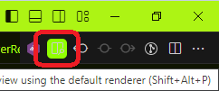

## Instalação com docker 
 - #### CASO NÃO QUEIRA USAR DOCKER [Clique aqui](https://github.com/Wallacewss2033/beta-bank)

- Clone o projeto
```
git clone git@github.com:Wallacewss2033/beta-backend.git
```
- Entre na raiz do prejeto ```beta-backend``` e clone o projeto ```beta-bank```
```
git clone git@github.com:Wallacewss2033/beta-bank.git
```

### Back-end
- ainda na pasta raíz do projeto ```beta-backend``` rode:
```
docker-compose up -d --build
```
- entre no terminal do container do projeto ```beta-backend``` 
 ```
 docker exec -it beta-bank bash
 ```
- no terminal do container rode:

```
composer install
```
- logo após rode esses comandos
```
cp .env.example .env
```
```
php artisan key:generate
```

- Não esqueça de configurar o banco de dados na ``` .env ```
  


OBS: user e senha do mysql ambos são ```root```

- Para criar o banco de dados
```
php artisan migrate
```

- Para popular a tabela de accounts
```
php artisan db:seed
```

OBS: CASO HAJA ALGUM PROBLEMA DE PERMISSÃO NO PROJETO RODE:

- chown -R root:www-data storage
- chmod -R 777 ./storage
- chmod -R 775 ./storage

### DOCUMENTAÇÃO

- A documentação foi criada no ```openapi 3.0.0```
- A documentação está no ```./documentations/doc-beta-bank.yml```

    ### Como usar:
    - baixe a extensão do vscode chamada 
        ```OpenAPI (Swagger) Editor```
    - abra o arquivo da documentação ```doc-beta-bank.yml```
    - click no icone no canto superior direito 

        
    - ou use o atalho (Shift+Alt+P)
    
